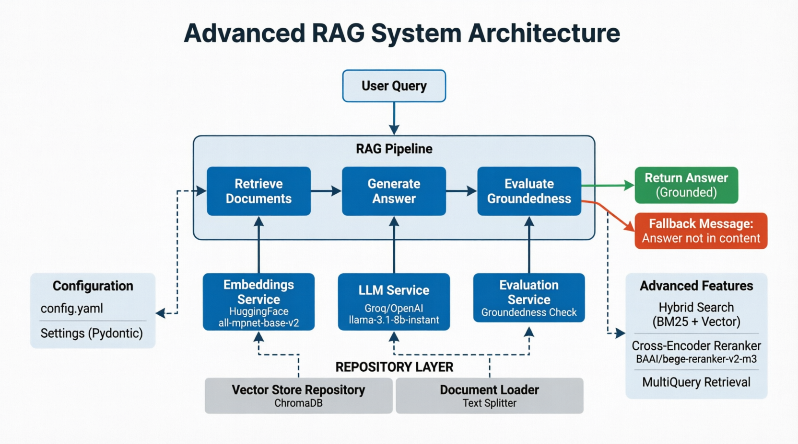

# 🚀 Advanced RAG Agent

A production-ready **Retrieval-Augmented Generation (RAG)** system with advanced retrieval strategies, cross-encoder reranking, and groundedness guardrails.


---

## 📋 Table of Contents

- [Features](#-features)
- [Architecture](#-architecture)
- [Installation](#-installation)
- [Configuration](#-configuration)
- [Usage](#-usage)
- [Project Structure](#-project-structure)
- [Testing](#-testing)
- [Development Phases](#-development-phases)
- [Future Improvements](#-future-improvements)
- [License](#-license)

---

## ✨ Features

### Core RAG Capabilities
- ✅ **Hybrid Search**: Combines BM25 (keyword) + Vector (semantic) retrieval
- ✅ **Cross-Encoder Reranking**: Re-ranks retrieved documents for better relevance
- ✅ **Groundedness Guardrail**: Detects hallucinations and returns fallback message
- ✅ **Persistent Vector Store**: ChromaDB with local persistence
- ✅ **Service Layer Architecture**: Clean, modular, production-ready code

### Advanced Features
- ✅ **MultiQuery Retrieval**: Generates query variations for better coverage
- ✅ **Document Caching**: Fast retrieval without re-loading documents
- ✅ **Configurable via YAML**: Change models, thresholds without code changes
- ✅ **Comprehensive Logging**: Debug and production logging to files
- ✅ **Pytest Test Suite**: Unit and integration tests for all components

### Guardrails
- ✅ **Answer Groundedness Check**: LLM evaluates if answer is supported by context
- ✅ **Fallback Message**: Returns `"Answer not in the content."` when hallucination detected
- ✅ **Error Handling**: Graceful failures with informative error messages

---

## 🏗️ Architecture



### Service Layer Pattern

| Layer | Responsibility | Examples |
| :--- | :--- | :--- |
| **Services** | Business logic | `LLMService`, `EmbeddingsService`, `RetrievalService`, `EvaluationService` |
| **Repositories** | Data access | `VectorStoreRepository`, `DocumentLoader` |
| **Core** | Orchestration | `RAGPipeline` |
| **Config** | Configuration | `Settings` (Pydantic + YAML) |

---

## 📦 Installation

### Prerequisites

- Python 3.10 or higher
- `uv` package manager (recommended) or `pip`

### Quick Start

```bash
# 1. Clone the repository
git clone https://github.com/yourusername/advanced-rag.git
cd advanced-rag

# 2. Create virtual environment (uv recommended)
uv venv
source .venv/bin/activate  # On Windows: .venv\Scripts\activate

# 3. Install dependencies
uv sync
# OR with pip:
pip install -e .

# 4. Set up environment variables
# Create a .env file in the project root and add your API keys:
# OPENAI_API_KEY=sk-your-api-key-here
# GROQ_API_KEY=gsk-your-api-key-here
# HF_TOKEN=hf-your-huggingface-api-key
```

## ⚙️ Configuration

Edit `src/config/config.yaml` to customize behavior:
# config.yaml

llm:
  provider: "groq"              # Options: openai, groq, ollama
  model: "llama-3.1-8b-instant"
  temperature: 0.0
  max_tokens: 1024

embedding:
  provider: "huggingface"
  model: "sentence-transformers/all-mpnet-base-v2"
  dimensions: 768

retrieval:
  top_k: 5                      # Final number of documents to use
  rerank_top_k: 10              # Initial retrieval count for reranking
  use_hybrid: true              # Enable BM25 + Vector hybrid search
  use_cross_encoder: true       # Enable cross-encoder reranking

reranker:
  model: "BAAI/bge-reranker-v2-m3"  # Reranker model
  device: "cpu"                 # or "cuda" for GPU

evaluation:
  groundedness_threshold: 0.7   # Threshold for guardrail
  fallback_message: "Answer not in the content."

vector_store:
  type: "chroma"
  persist_directory: "./data/chroma_db"
  collection_name: "rag_collection"

```

## 🚀 Usage

### 1. Ingest Documents

Place your documents in `data/documents/` (supports `.txt`, `.pdf`, `.md`):

```bash
# Run ingestion pipeline
python -m src.repositories.ingest
```

### 2. Run the RAG

Interactive mode:

```bash
python src/main.py
```

### 3. Test the Guardrail

Query something NOT in your documents:

```bash
python src/main.py "Who is the CEO of Google?"
```

Expected output:

```
🔍 Thinking...
🤖 Agent: Answer not in the content.
```

### 📂 Project Structure

advanced-rag/
├── .env                        # Environment variables (API keys)
├── .gitignore                  # Git ignore rules
├── pyproject.toml              # Project dependencies & metadata
├── README.md                   # This file
│
├── src/                        # Source code package
│   ├── __init__.py
│   ├── main.py                 # CLI entry point
│   │
│   ├── config/                 # Configuration management
│   │   ├── __init__.py
│   │   └── settings.py         # Pydantic settings loader
│   │├── config.yaml         # YAML configuration file
│   │   
│   ├── core/                   # Orchestration layer
│   │   ├── __init__.py
│   │   └── pipeline.py         # RAGPipeline (main orchestrator)
│   │
│   ├── repositories/           # Data access layer
│   │   ├── __init__.py
│   │   ├── vector_store.py     # ChromaDB repository
│   │   ├── document_loader.py  # Document loading & splitting
│   │   └── ingest.py           # Ingestion script
│   │
│   ├── services/               # Business logic layer
│   │   ├── __init__.py
│   │   ├── llm_service.py      # LLM initialization & generation
│   │   ├── embeddings_service.py # Embedding model management
│   │   ├── retrieval_service.py  # Hybrid search & reranking
│   │   ├── evaluation_service.py # Groundedness evaluation
│   │   └── test_retrieval.py   # Retrieval testing script
│   │
│   └── utils/                  # Utilities
│       ├── __init__.py
│       └── logger.py           # Centralized logging
│
├── tests/                      # Test suite
│   ├── test_embeddings_service.py
│   ├── test_vector_store.py
│   ├── test_retrieval_service.py
│   ├── test_pipeline.py        # End-to-end pipeline tests
│   └── test_phase1.py          # Phase 1 integration
│   └── test_pipeline.py        # End-to-end pipeline tests
│
├── data/                       # Local data (gitignored)
│   ├── documents/              # Raw documents for ingestion
│   ├── chroma_db/              # Persistent vector store
│   └── documents_cache.pkl     # Cached document chunks
│
└── logs/                       # Application logs (gitignored)
    └── rag_agent.log

```

## 🧪 Testing

```bash
# Run full test suite
pytest tests/ -v

# Run with coverage
pytest tests/ --cov=src -v

# Run specific test file
pytest tests/test_pipeline.py -v
```

## 📚 Development Phases

- **Phase 1**: Basic RAG pipeline with BM25 + Vector hybrid search ✅
- **Phase 2**: Cross-encoder reranking integration ✅
- **Phase 3**: Groundedness evaluation guardrail ✅
- **Phase 4**: Production deployment and monitoring (future)

## 🔮 Future Improvements

- [ ] Support for additional vector databases (Pinecone, Weaviate)
- [ ] Query expansion strategies (HyDE, Multi-query)
- [ ] Caching layer for repeated queries
- [ ] Web UI for document management and querying
- [ ] Metrics and observability dashboard
- [ ] Support for multimodal documents (images, tables)
- [ ] Fine-tuned reranker for domain-specific content

## 📬 Contact

- **Project Link**: https://github.com/Lakshitha6/advanced-rag
- **Issues**: Please report bugs via GitHub Issues

## 🙏 Acknowledgments

- **LangChain** - LLM orchestration framework
- **ChromaDB** - Vector database and persistence
- **HuggingFace** - Model hosting and transformers library
- **BAAI** - Cross-encoder reranker models
- **RankBM25** - BM25 keyword search implementation

<div align="center">

Built with ❤️ for learning and production  
⭐ Star this repo if you find it helpful!

</div>